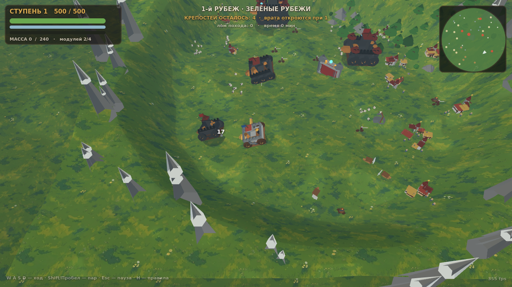
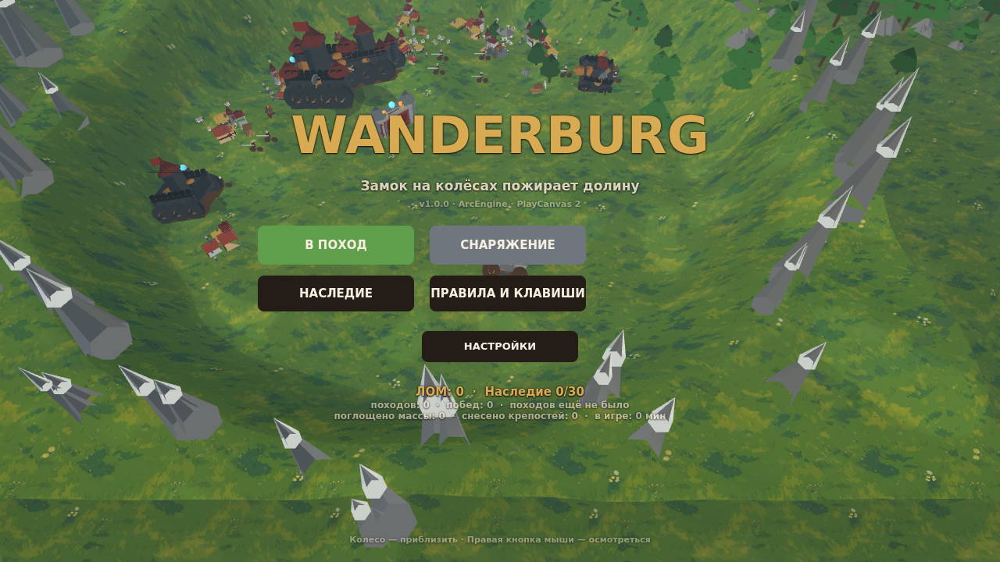
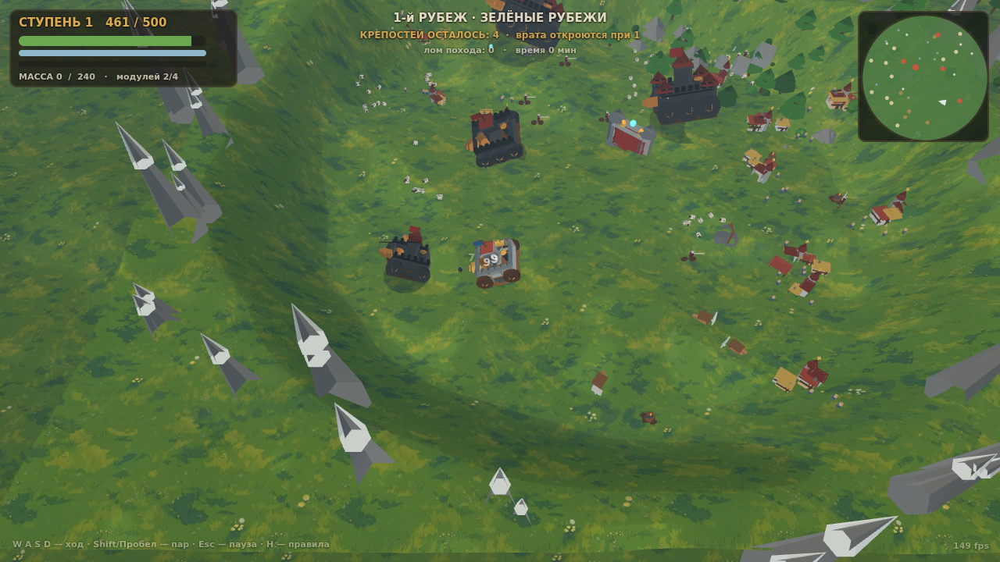
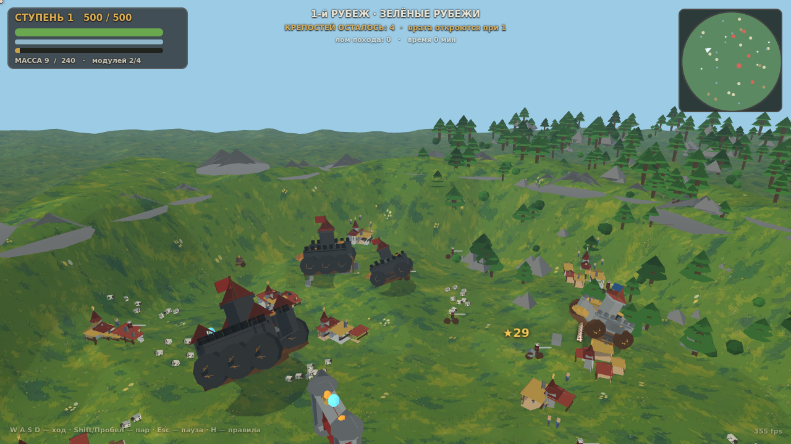

# WANDERBURG — замок на колёсах пожирает долину

Минималистичный средневеково-стимпанковый **экшен-рогалик о мобильной крепости**.
Замки здесь не обороняются — они **ездят**. Целые цитадели на колёсах катятся по долинам,
пожирают деревни, стада и рудники, таранят и расстреливают друг друга: выживает только
самая крупная и прожорливая твердыня. Ваша начинается как скромная крепостица с одной
бомбардой — и за забег вырастает в восьмислотную боевую машину с арканными башнями,
мортирами и паровым тараном.



*Меню:*  · *Бой и HUD:*  · *Горное кольцо:* 

Сделано на [ArcEngine (PlayArcEngine)](https://github.com/zavodilo/PlayArcEngine) —
zero-dependency наборе для 3D-игр в браузере (PlayCanvas 2, vanilla JS, без npm и без
сборки). Вся геометрия, звук и музыка игры **синтезируются кодом**: в репозитории нет ни
одного привезённого арт- или аудиофайла, кроме земных текстур набора (и `assets/models/character.glb` —
фикстура теста glTF, которую байт в байт собирает `tools/make-character.mjs`).

---

## Как играть

Игра опубликована на GitHub Pages: **https://zavodilo.github.io/Wanderburg/** — открывается
меню, за которым уже живёт долина; «В ПОХОД» — и вы в ней. Локально:

```
node tools/dev-server.mjs        # игра на http://localhost:8080
node tools/arc.mjs run           # то же через кросс-платформенный CLI
node tools/arc.mjs editor        # веб-редактор набора (константы, UI-раскладка)
node tools/arc.mjs check         # типы + тесты + синхронность скиллов
node tools/arc.mjs check --all   # релизные ворота: + headless-рендер и visual smoke
node tools/arc.mjs build         # dist/wanderburg-<version>.zip — играбельно без репозитория
```

Открыли страницу — попали в меню, за которым **уже живёт долина** (attract-загон: крепость
катается и ест деревеньки). «В ПОХОД» — и вы в ней.

### Управление

| | |
|---|---|
| `W / S`, `↑ / ↓` | газ и задний ход |
| `A / D`, `← / →` | поворот корпуса |
| `Shift` / `Пробел` | поддать пару: ускорение и усиленный таран (тратит пар) |
| мышь (ПКМ) | осмотреться; колесо — приближение; `R` — вернуть камеру к замку |
| `1–4` | взять чертёж в выборе улучшения |
| `R` (в выборе) / `Esc` | сменить выбор / пропустить выбор |
| `Esc`, `P` | пауза |
| `H` | правила и клавиши |
| `M` | звук вкл/выкл |
| `Tab` | скрыть интерфейс |
| телефон | круг слева — ход и поворот, кнопка «ПАР» справа |

### Цикл забега

1. **Пожирать.** Деревни убегают — догоняйте. Стада разбегаются. Каменоломни и рудники
   стоят и медленно «жуются». Всё съеденное распадается на обломки и **всасывается в корпус**:
   задержитесь на месте побоища, чтобы собрать массу целиком.
2. **Расти.** Масса повышает **ступень корпуса** (1→5): больше размер, прочность и слоты.
   Каждая ступень открывает **чертёж**: выбор из четырёх карт — новый модуль, уровень старого,
   ремонт или лом. Пул зависит от редкости, купленных чертежей и свободных слотов.
3. **Охотиться.** Бродячие крепости тоже едят долину и дерутся между собой. Съешьте почти все —
   откроются **врата вардена**.
4. **Убить вардена.** Босс рубежа с двумя стадиями ярости и зарядом-тараном с телеграфом.
   Убийство очищает рубеж: долина сменяется следующей (4 рубежа: Зелёные Рубежи → Пепельная
   Степь → Хладоземье → Железный Венец с финальным боссом), сложность и награды растут.
5. **Умереть и вернуться.** Лом и открытия уходят в **Наследие** — мета-прогрессию между
   забегами: новые корпуса, капитаны, чертежи модулей и перки.

### Системы

* **Модули (20):** бомбарда, кулеврина, паровой пулемёт, баллиста, арканная башня, мортира,
  огнемёт, громоотвод, улей + пассивные (котёл, броня, кладка, мастерская, бочка, таран,
  знамя ужаса, парус, гнездо, реликварий, топка). У каждого 3 уровня; турели крутятся сами,
  мортира и телеграф бьют по площади.
* **Корпуса (5):** Катящаяся Крепость, Железная Гусеница, Лесная Рама, Арканный Понтон,
  Дредноут — разные слоты, скорость, броня и стартовый модуль.
* **Капитаны (8):** пассивные стили (Когсворт, Векс, Аббат, Грюбб, Бранн, Серафина, Мордрек, Изольт).
* **Наследие (30 покупок):** чертежи, корпуса, капитаны и перки за лом; прогресс в localStorage.
* **Мир:** процедурная долина-«чаша» (симплекс-шум + горное кольцо), 4 биома со своими палитрами,
  светом, туманом, землёй и музыкой; деревни со своими именами и убегающими крестьянами.

---

## Архитектура

Набор ArcEngine (единый визуальный пайплайн) остаётся нетронутым движком; игра лежит своими
файлами поверх него и говорит с ним через семантический слой:

| Слой набора | Где в игре |
|---|---|
| `js/engine/` — единственное место, знающее `pc.*` (PlayCanvas) | как в наборе; игра ничего в нём не правит |
| `js/core/` — модель игры без рендера (`GameModel`, `World`, `Entity`, `Save`, `Scene`) | контракт проекта: `js/GameSpec.js` загружается в `GameModel` |
| `js/presentation/` — профили, варианты, миграции, рантайм | `presentation/variants/wanderburg-*.json` — пять презентаций ОДНОЙ игры |
| `js/profiles/` — адаптеры профилей | как в наборе |
| игровой код | `js/Logic.js` (истина), `js/WanderView.js`/`js/WanderMesh.js` (картина), `js/Game.js` (оркестратор) |

Игра **сама рисует свои сущности**: записи `GAME_SPEC.entities` несут
`visual.representation: 'none'`, поэтому пайплайн не рисует вторую копию замка, а
`VisualEntity.sync` считает их как *self-presented* (видно в `arc variant list`,
матрице профилей и headless-гейте). Реестр ролей (`GAME_SPEC.assets`) при этом полный: он —
машинная цель миграции, «что чем станет в другом профиле».

Игровые файлы поверх движка:

| Файл | Роль |
|---|---|
| `js/Constants.js` | все числа: константы набора + блок `WANDER_*` (баланс) + снимок `WANDER_CFG` |
| `js/Content.js` | данные: биомы, корпуса, капитаны, модули, наследие, loadout-ы врагов, имена |
| `js/Logic.js` | **симуляция без рендера**: `WBRegion` (генерация), `WBRun` (кадр забега, бой, ИИ, чертёж, врата, босс), `WB.Save` (мета) |
| `js/WanderMesh.js` | процедурная геометрия: примитивы, замки, модули, деревни, горы, снаряды |
| `js/WanderView.js` | **картина**: сборка сцены из симуляции, пулы снарядов/частиц, миникарта, летающие цифры, биом-свет |
| `js/WanderAudio.js` | события → звук; пар и гул корпуса; музыка биомов; микшер игрока |
| `js/Hud.js` | экраны и HUD: меню, снаряжение, наследие, настройки, правила, чертёж, пауза, итоги |
| `js/Game.js` | оркестратор: состояния, ввод (клавиши + тач), камера, attract-режим |

Инварианты (их держат тесты):

* `Game.js` не пишет `pc.*` (контракт набора для агентного кода, `tests/apigate.test.mjs`) и не
  ветвится по профилю рендера (`tests/pipeline-layers.test.mjs`); вся работа с движком — в
  `WanderView.js`/`WanderMesh.js`.
* Симуляция остаётся владельцем истины: `js/Game.js` зеркалит в `GameModel` только то, что
  переживает кадр (замок игрока, врата вардена, прогрессию, активную сцену) — координаты через
  `Coords` (карта игры — зеркало канонического пространства набора).
* Симуляция детерминирована от сида (`WB.RNG`, mulberry32): один сид — один забег.
* HUD — только данные: раскладка в `js/UILayout.js` (пишется редактором или `tools/make-ui.mjs`
  в байт-точном формате редактора), код лишь кормит элементы по id.
* Числа баланса живут только в `Constants.js`/`Content.js`; тест `tests/wanderburg.test.mjs`
  сторожит, в частности, разделение «оружейных» полей модуля и полей-модификаторов.

### Единый визуальный пайплайн: одна игра — пять презентаций

Отгружаемая презентация — профиль `lowpoly3d` (`wanderburg-lowpoly3d`): перспективная камера,
лоу-поли меши, тон-полосы с чернильными рёбрами, без карты теней (у каждого корпуса своя
blob-тень). Вариант несёт ровно те числа камеры и шейдинга, что живут в `Constants.js`, поэтому
применение пайплайна ничего не меняет на экране — оно его документирует и проверяет.

```
node tools/arc.mjs run                 # игра (вариант по умолчанию)
node tools/arc.mjs run --all           # пять вкладок: ОДНО дерево, пять презентаций
node tools/arc.mjs run --variant wanderburg-isometric3d
node tools/arc.mjs variant list        # варианты, общий contract hash и схема сохранений
node tools/arc.mjs check --profiles    # матрица профилей и конверсий без браузера
node tools/arc.mjs variant plan --from wanderburg-lowpoly3d --to 2d   # сухой прогон миграции
node tools/arc.mjs variant convert --source wanderburg-lowpoly3d --profile 2d --write-placeholders
```

Варианты `wanderburg-2d` и `wanderburg-2.5d` — **цели миграции**, а не готовые презентации:
у игры нет спрайтовой графики (все меши строятся кодом), поэтому в них реестр ролей
разрешается в генерируемые заглушки (`--write-placeholders` материализует их в PNG), а мир
остаётся трёхмерным полем высот: горное кольцо — часть геймплея, и ни один профиль его не
плоскает. `contractHash` и `saveSchemaHash` одинаковы во всех пяти вариантах — машинное
доказательство, что игра одна.

### Проверка

```
node tools/check.mjs             # tsc-типы JSDoc + тесты + скиллы + манифесты + drift вариантов
node tools/check.mjs --profiles  # матрица профилей и конверсий (headless)
node tools/check.mjs --all       # релизный гейт: + headless-рендер, visual smoke, варианты в браузере
node --test tests/wanderburg.test.mjs    # тесты самой игры (детерминизм, генерация, бой, чертёж)
NODE_PATH=<puppeteer> node tools/headless-gate.mjs --all   # то же напрямую (puppeteer — dev-only)
node verify/input.mjs            # контракт ввода в Chrome: тру-клавиши + детерминированные кадры
WB_URL=https://zavodilo.github.io/Wanderburg node verify/input.mjs   # тот же контракт по деплою
node verify/shots.mjs 40         # скриншоты живого забега с автопилотом (verify/mig-*.png)
node verify/smoke.mjs 4242 4     # автопилот играет забеги: темп, ступени, смертность
node verify/bossrun.mjs 777      # цепочка «варден → следующий рубеж» end-to-end
```

### Свои инструменты

* `tools/make-wander-sounds.mjs` — синтез всех 36 звуковых файлов (эффекты + 5 музыкальных
  петлей): осцилляторы, шум, огибающие; ничего записанного.
* `tools/make-ui.mjs` — генерация `js/UILayout.js` через форматтер редактора набора.

---

## Лицензия и благодарности

MIT. Движок — [ArcEngine / PlayArcEngine](https://github.com/zavodilo/PlayArcEngine) (MIT),
внутри — PlayCanvas 2 (MIT) и simplex-noise (MIT); см. `NOTICE`.
